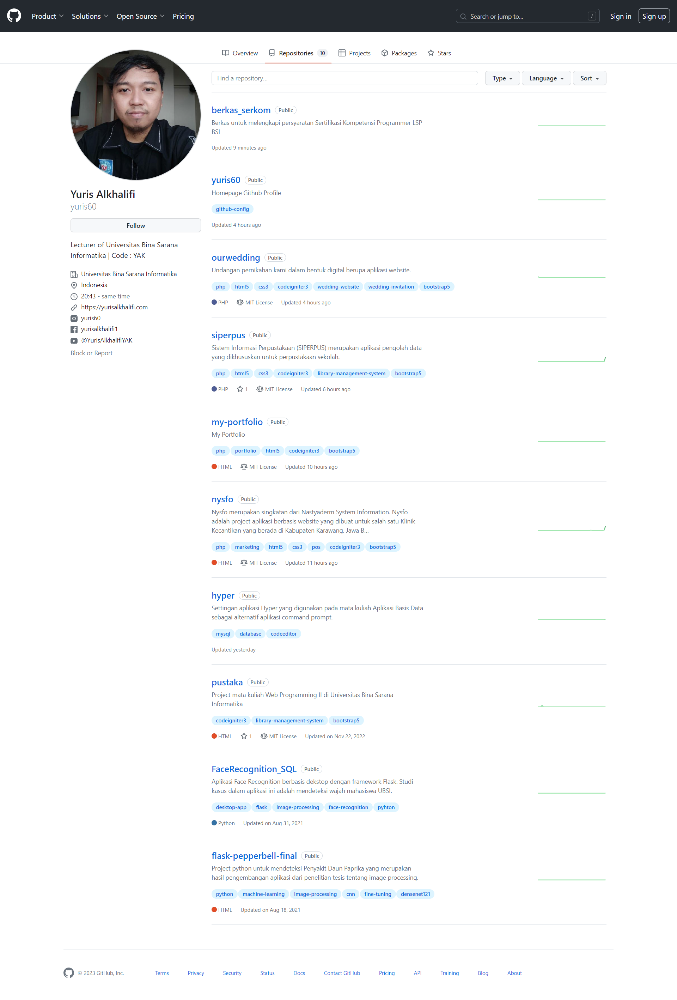

# Berkas Serkom Programmer Tahun 2023

  

Salam sejahtera bagi kita semuanya.

Yth. Bpk/Ibu Asesor Sertifikasi Kompetensi  
Berikut ini saya lampirkan persyaratan untuk Sertifikasi Kompetensi LSP BSI, yang terdiri dari:

- `Berkas Pengajuan`
- `Jurnal`
- `ST Mengajar`
- `Webinar/Workshop`
- `Project`

## Project
Adapun folder project saya lampirkan pada repository yang ada luar repository ini, atau dapat dikunjungi pada tautan <a href="https://github.com/yuris60?tab=repositories">disini</a>. Berikut ini tampilan folder repository project yang saya lampirkan:

  

<!-- ## Permohonan Maaf
Mohon maaf dikarenakan sebelumnya saya sudah terlanjur submit dengan menggunakan tautan Github pada laman LSP BSI, jadi saya lampirkan pelengkap persyaratan melalui Repository ini. -->

## Ucapan Terimakasih
Terimakasih atas perhatian bapak/ibu, semoga dengan berkas yang saya lampirkan melalui akun Github saya, saya bisa mendapatkan status <strong>kompeten</strong>.

<blockquote>Salam Kompeten👋</blockquote>
